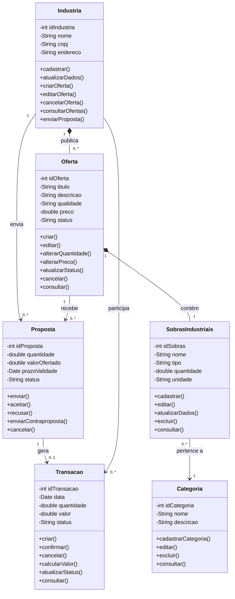

# Diagrama de Classes — Marketplace B2B de Sobras Industriais

```mermaid
classDiagram
    class Industria {
        -int idIndustria
        -String nome
        -String cnpj
        -String endereco
        +cadastrar()
        +atualizarDados()
        +criarOferta()
        +editarOferta()
        +cancelarOferta()
        +consultarOfertas()
        +enviarProposta()
    }

    class Oferta {
        -int idOferta
        -String titulo
        -String descricao
        -String qualidade
        -double preco
        -String status
        +criar()
        +editar()
        +alterarQuantidade()
        +alterarPreco()
        +atualizarStatus()
        +cancelar()
        +consultar()
    }

    class SobrasIndustriais {
        -int idSobras
        -String nome
        -String tipo
        -double quantidade
        -String unidade
        +cadastrar()
        +editar()
        +atualizarDados()
        +excluir()
        +consultar()
    }

    class Categoria {
        -int idCategoria
        -String nome
        -String descricao
        +cadastrarCategoria()
        +editar()
        +excluir()
        +consultar()
    }

    class Proposta {
        -int idProposta
        -double quantidade
        -double valorOfertado
        -Date prazoValidade
        -String status
        +enviar()
        +aceitar()
        +recusar()
        +enviarContraproposta()
        +cancelar()
    }

    class Transacao {
        -int idTransacao
        -Date data
        -double quantidade
        -double valor
        -String status
        +criar()
        +confirmar()
        +cancelar()
        +calcularValor()
        +atualizarStatus()
        +consultar()
    }

    Industria "1" *-- "0..*" Oferta : publica
    Industria "1" --> "0..*" Proposta : envia
    Oferta "1" --> "0..*" Proposta : recebe
    Proposta "1" --> "0..1" Transacao : gera
    Industria "1" --> "0..*" Transacao : participa
    Oferta "1" *-- "1" SobrasIndustriais : contém
    SobrasIndustriais "0..*" --> "1" Categoria : pertence a
```
