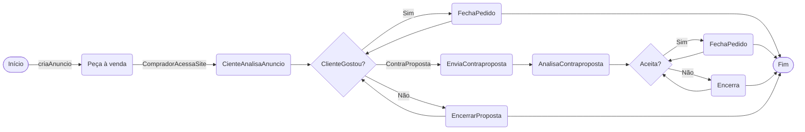

```mermaid
flowchart LR
    inicio([Início]) -->|criaAnuncio| A(Peça à venda)


    A --> |CompradorAcessaSite| B(CienteAnalisaAnuncio)
   
    B --> C{ClienteGostou?}


    C --> |Sim| D(FechaPedido)
    D --> C


    C --> |ContraProposta| E(EnviaContraproposta)
    E --> F(AnalisaContraproposta)
    F --> G{Aceita?}


    G --> |Sim| H(FechaPedido)
    H --> G


    G --> |Não| I(Encerra)
    I --> G


    C --> |Não| J(EncerrarProposta)
    J --> C


    D --> fim([Fim])
    H --> fim([Fim])
    I --> fim([Fim])
    J --> fim([Fim])
   
```
