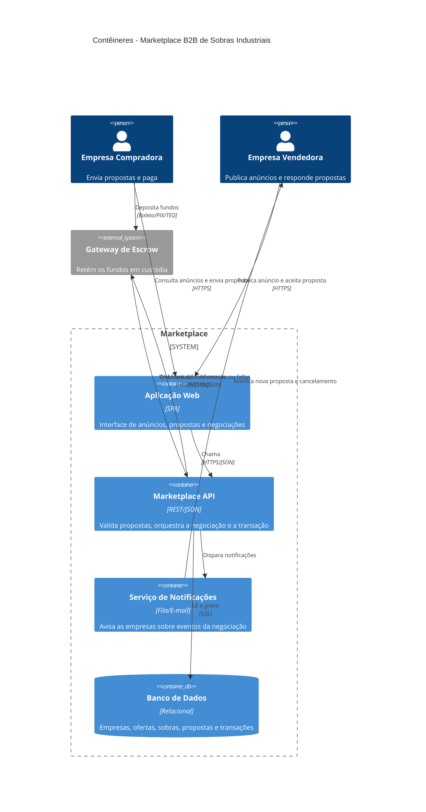

# Diagrama de Contêineres (C4 Nível 2)

```mermaid
C4Container
    title Contêineres - Marketplace B2B de Sobras Industriais

    Person(comprador, "Empresa Compradora", "Envia propostas e paga")
    Person(vendedor, "Empresa Vendedora", "Publica anúncios e responde propostas")

    System_Boundary(mkt, "Marketplace") {
        Container(web, "Aplicação Web", "SPA", "Interface de anúncios, propostas e negociações")
        Container(api, "Marketplace API", "REST/JSON", "Valida propostas, orquestra a negociação e a transação")
        Container(notif, "Serviço de Notificações", "Fila/E-mail", "Avisa as empresas sobre eventos da negociação")
        ContainerDb(db, "Banco de Dados", "Relacional", "Empresas, ofertas, sobras, propostas e transações")
    }

    System_Ext(escrow, "Gateway de Escrow", "Retém os fundos em custódia")

    Rel(comprador, web, "Consulta anúncios e envia proposta", "HTTPS")
    Rel(vendedor, web, "Publica anúncio e aceita proposta", "HTTPS")
    Rel(web, api, "Chama", "HTTPS/JSON")
    Rel(api, db, "Lê e grava", "SQL")
    Rel(api, notif, "Dispara notificações")
    Rel(notif, vendedor, "Notifica nova proposta e cancelamento")
    Rel(api, escrow, "Cria transação de escrow", "HTTPS/JSON")
    Rel(comprador, escrow, "Deposita fundos", "Boleto/PIX/TED")
    Rel(escrow, api, "Webhook de confirmação ou falha", "HTTPS/JSON")

    UpdateLayoutConfig($c4ShapeInRow="3", $c4BoundaryInRow="1")
```